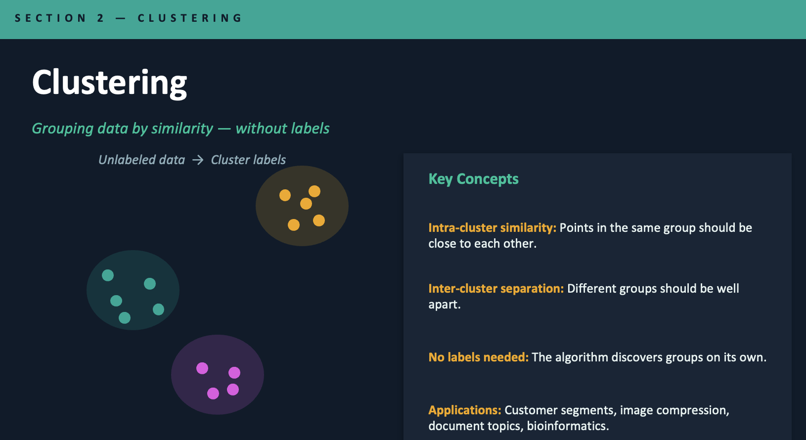
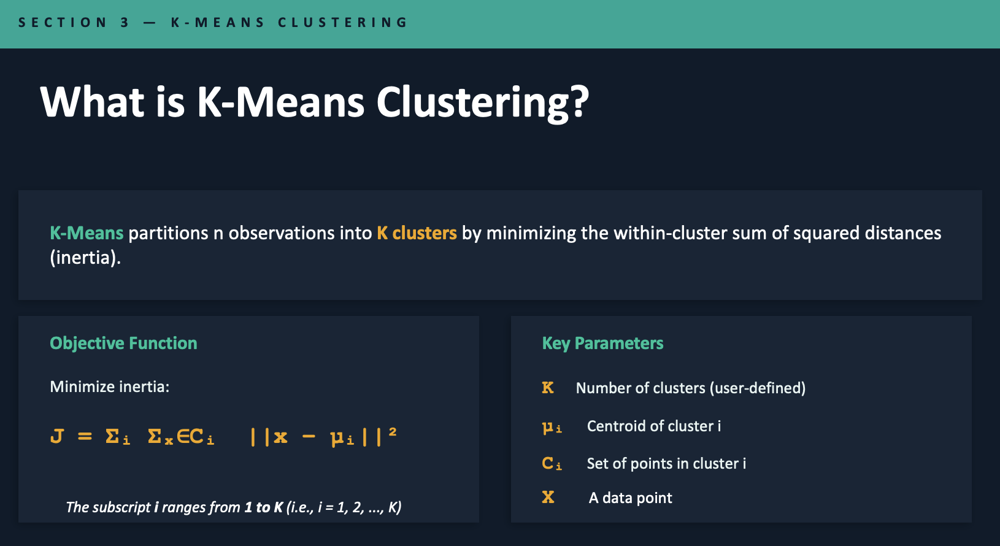
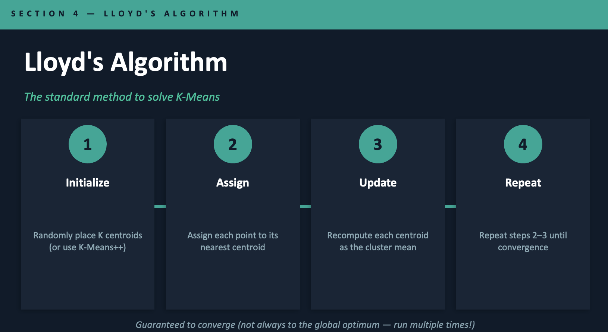
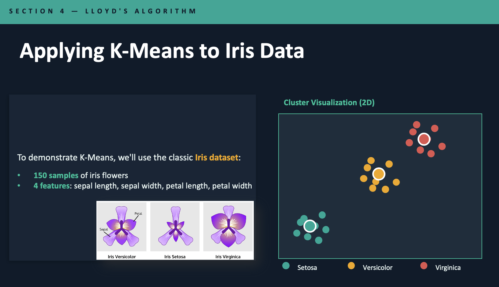
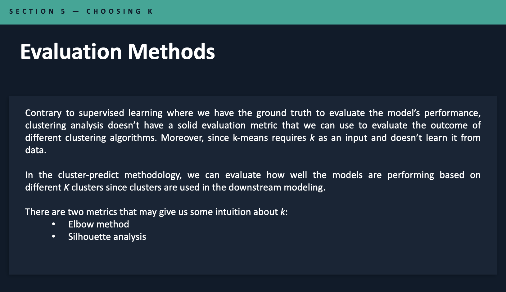
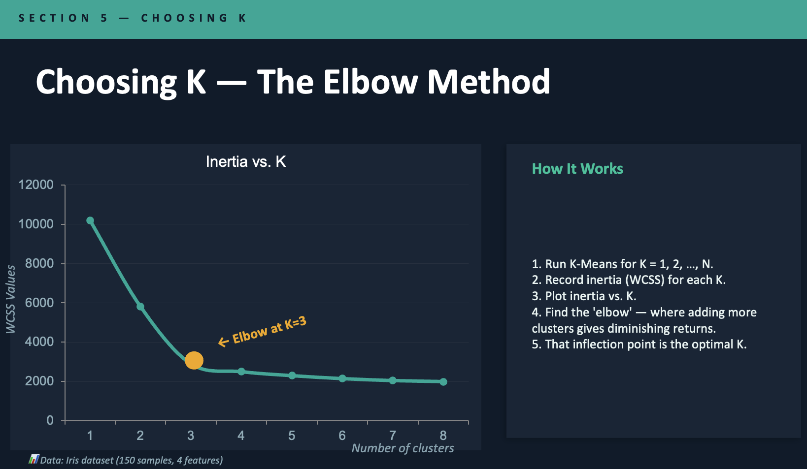
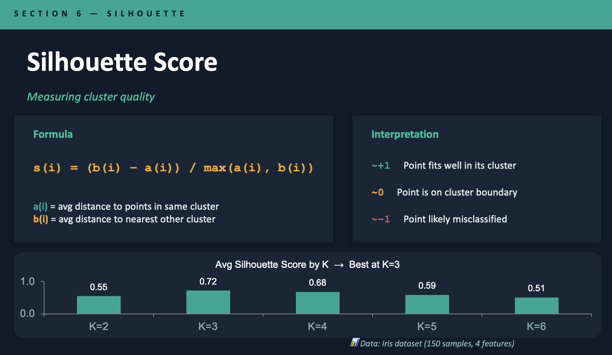

# PK-Means Clustering

## Table of Contents

- [About](#about)
- [Getting Started](#getting_started)
- [Usage](#usage)
- [Contributing](../CONTRIBUTING.md)

## About 

Final project for Data Structures and Algorithms.

## Getting Started 

This is just a jupyter notebook that shows how to implement Lloyd's Algorithm on
K-Means Clustering

### Some important facts:

 

 

 

 

 

 

## Usage 

Just for study purposes
